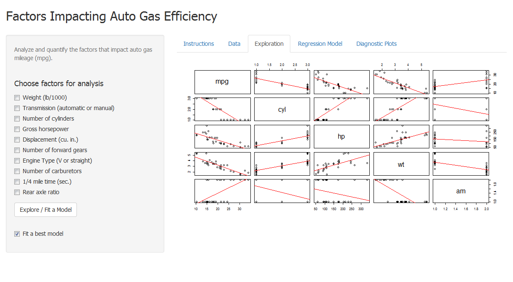

## Introduction
<br>
This [Shiny application](https://bmei.shinyapps.io/Project/) helps:

1. explore linear relationships between variables in the `mtcars` dataset;

2. fit multiple linear regression models between gas miles per gallon (mpg) and user-selected variables;

3. fit a best-fitted model automatically if instructed so; and

4. display model summary, diagnostic plots, as well as the data on which model fitting is made.

With this app, exploration of the `mtcars` data and fitting models between the miles per gallon (mpg) variable and the other variables are made very easy, saving the analyst a bit time and effort. 

--- .class #id 

## The Application

Here is a screenshot of the shiny app.



--- .class #id

## How to Use this App

##### The following steps can be followed to use this application:

1. In the sidebar panel on the left, select the variables you wish to use as predictor variables (and make sure the `Fit a best model` box unchecked), and then click the `Explore \ Fit a Model` button.
2. To let the application fit a best model for you, check the `Fit a best model` checkbox and then click
the `Explore \ Fit a Model` button. The app chooses the variables that can best explain the dependent variable for you with the highest `adjusted` R squared value.
3. By clicking the `Explore \ Fit a Model` button, the app performs exploratory data analysis and linear regression model fitting.
4. To check the linear relationship / correlation between any two variables (incluidng the dependent variable, mpg), go to the Exploration tab.
5. To see the fitted linear regression model and model summary, go to the Regression Model tab.
6. To analyze and diagnose the fitted model, four diagnostic plots of the model are on the Diagnostic Plots tab.

--- .class #id

## Code Example

The core code used to fit the `best` multiple regression model is as follows.
```{r eval=FALSE}
init_model <- lm(mpg ~ ., data = mtcars)
modelFit <- step(init_model, direction="both", trace=0); modelFit
```
```{r echo=FALSE}
data(mtcars)
mtcars$cyl <- as.factor(mtcars$cyl)
mtcars$am <- as.factor(mtcars$am)
mtcars$gear <- as.factor(mtcars$gear)
mtcars$carb <- as.factor(mtcars$carb)
mtcars$vs <- as.factor(mtcars$vs)
init_model <- lm(mpg ~ ., data = mtcars)
modelFit <- step(init_model, direction="both", trace=0); modelFit
```

An initial model is fitted with all available variables in the dataset included.  Then the <em>step</em> function removes the variables that has no significant contribution to the model and returns a model with the highest adjusted R squared value.
