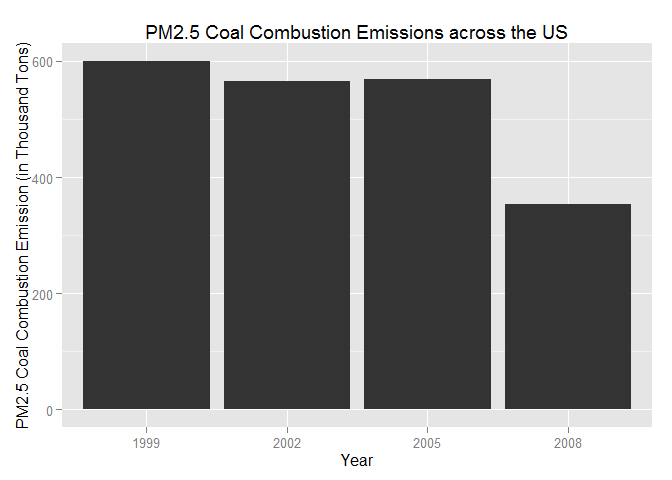

Exploratory Data Analysis: Project 2
========================================================
<br>

### Assignment
The overall goal of this assignment is to explore the National Emissions Inventory database and see what it say about fine particulate matter pollution in the United states over the 10-year period 1999-2008. You may use any R package you want to support your analysis.

You must address the following questions and tasks in your exploratory analysis. For each question/task you will need to make a single plot. Unless specified, you can use any plotting system in R to make your plot.
<br><br>

### Data
Downlad data file & upzip it.

```r
dataFile_zp <- "exdata-data-NEI_data.zip"

if (!file.exists(dataFile_zp)) {
    URL <- "https://d396qusza40orc.cloudfront.net/exdata%2Fdata%2FNEI_data.zip"
    download.file(url=URL, destfile = dataFile_zp)
}

if (!file.exists("Source_Classification_Code.rds") || !file.exists("summarySCC_PM25.rds")) {
    unzip(dataFile_zp)
}
```

Read NEI and SCC data into R.

```r
if (!"NEI" %in% ls()) {
    NEI <- readRDS("summarySCC_PM25.rds")
}
if (!"SCC" %in% ls()) {
    SCC <- readRDS("Source_Classification_Code.rds")
}
```
<br>

### Question 1
<b>Have total emissions from PM2.5 decreased in the United States from 1999 to 2008?</b>

First, aggregate the total PM2.5 emission from all sources for each of the years 1999, 2002, 2005, and 2008.  Then plot the total PM2.5 Emission from all sources using the base plotting system.

```r
totalsByYear <- aggregate(Emissions ~ year, data=NEI, sum)
barplot(totalsByYear$Emissions/10^6, names.arg=totalsByYear$year,
         xlab="Year", ylab="PM2.5 Emissions (in Million Tons)", col="red",
         main="Total PM2.5 Emission from All Sources in the US"
)
```

 

**Answer**: As can be seen from the plot above, total PM2.5 emissions from PM2.5 have decreased in the US from 1999 to 2008.
<br><br>

### Question 2

<b>Have total emissions from PM2.5 decreased in the Baltimore City, Maryland (fips == "24510") from 1999 to 2008?</b>

Subset Baltimore County data.

```r
bcNEI <- NEI[NEI$fips=="24510",]
```

Calculate the sum of total PM2.5 emissions by year and plot.

```r
totalsByYear_bc <- aggregate(Emissions ~ year, data=bcNEI, sum)
barplot(totalsByYear_bc$Emissions/10^3, names.arg=totalsByYear_bc$year,
        xlab="Year", ylab="PM2.5 Emissions (in Thousand Tons)", col="red",
        main="Baltimore County Total PM2.5 Emission from All Sources"
)
```

 

**Answer**: As the plot shows, the total emissions from PM2.5 have overall decreased in Baltimore City, Maryland from 1999 to 2008, but there was an increase in 2005.
<br><br>

### Question 3

<b>Of the four types of sources indicated by the type (point, nonpoint, onroad, nonroad) variable, which of these four sources have seen decreases in emissions from 1999-2008 for Baltimore City? Which have seen increases in emissions from 1999-2008?</b>


```r
library(ggplot2)

bc_plot <- ggplot(bcNEI, aes(x=factor(year), y=Emissions, fill=type)) +
           geom_bar(stat="identity") + facet_grid(. ~ type) +
           labs(x="Year", y="Total PM2.5 Emission (Tons)", 
                title="Baltimore City PM2.5 Emissions by Source Type")

print(bc_plot) 
```

 

**Answers**: PM2.5 emissions from the `non-road`, `nonpoint`, and `on-road` source types have all seen decreases overall from 1999-2008 in Baltimore City.  However, PM2.5 emissions from the `point` source varied a bit from 1999-2008. It had a significant increase from 1999 to 2005 and then it decreases again till 2008, whose emission is slightly higher than that of 1999.
<br><br>

### Question 4

<b>Across the United States, how have emissions from coal combustion-related sources changed from 1999-2008?</b>

Subset coal combustion data. Based on my exploration, seaching for "coal" (case-insensitive) in the <b>EI.Sector</b> column of the SCC dataset can identify most of coal combustion cases, while the <b>SCC.Level.Three</b> column can contribute a few more.

```r
pickCoal1 <- grepl("coal", SCC$EI.Sector, ignore.case=TRUE)
pickCoal2 <- grepl("coal", SCC$SCC.Level.Three, ignore.case=TRUE)
coalComb <- (pickCoal1 | pickCoal2)
SCC_cc <- SCC[coalComb,]$SCC
ccNEI <- NEI[NEI$SCC %in% SCC_cc,]
```

Now plot.

```r
library(ggplot2)

cc_plot <- ggplot(ccNEI, aes(x=factor(year), y=Emissions / 10^3)) +
           geom_bar(stat="identity") + 
           labs(x="Year", y="PM2.5 Coal Combustion Emission (in Thousand Tons)", 
                title="PM2.5 Coal Combustion Emissions across the US")

print(cc_plot)
```

 

**Answer**: Yes, overall emissions from coal combustion-related sources decreased from 1999 to 2008, while there was a very slight increase from 2002 to 2005.  The decrease from 2005 to 2008 was significant.
<br><br>

### Question 5

<b>How have emissions from motor vehicle sources changed from 1999-2008 in Baltimore City?</b>

Subset vehicle-related NEI data. Based on my exploration, seaching for "vehicle" (case-insensitive) in the <b>SCC.Level.Two</b> column of the SCC dataset can identify motor vehicle cases.

```r
pickVehs <- grepl("vehicle", SCC$SCC.Level.Two, ignore.case=TRUE)
SCC_vehs <- SCC[pickVehs,]$SCC
vehsNEI <- NEI[NEI$SCC %in% SCC_vehs,]
```

Subset Baltimore City's vehicle-related NEI data.

```r
bcVehNEI <- vehsNEI[vehsNEI$fips=="24510",]
```

Now plot.

```r
bc_veh_plot <- ggplot(bcVehNEI, aes(x=factor(year), y=Emissions)) +
               geom_bar(stat="identity") + 
               labs(x="Year", y="PM2.5 Motor Vehicle Emission (in Tons)", 
                    title="PM2.5 Motor Vehicle Emissions of Baltimore City")

print(bc_veh_plot)
```

 

**Answer**: Emissions from motor vehicle sources decreased from 1999-2008 in Baltimore City. The drop from 1999 to 2002 was huge, which was from about 400 tons to below 200 tons.
<br><br>

### Question 6

<b>Compare emissions from motor vehicle sources in Baltimore City with emissions from motor vehicle sources in Los Angeles County, California (fips == "06037"). Which city has seen greater changes over time in motor vehicle emissions?</b>

Subset vehicle-related NEI data.

```r
pickVehs <- grepl("vehicle", SCC$SCC.Level.Two, ignore.case=TRUE)
SCC_vehs <- SCC[pickVehs,]$SCC
vehsNEI <- NEI[NEI$SCC %in% SCC_vehs,]
```

Subset Baltimore City's vehicle-related NEI data.

```r
bcVehNEI <- vehsNEI[vehsNEI$fips=="24510",]
bcVehNEI$Location <- "Baltimore City"
```

Subset Los Angeles's vehicle-related NEI data.

```r
laVehNEI <- vehsNEI[vehsNEI$fips=="06037",]
laVehNEI$Location <- "Los Angeles County"
```

Combine two data sets.

```r
combVehNEI <- rbind(bcVehNEI, laVehNEI)
```

Now plot.

```r
veh_plot <- ggplot(combVehNEI, aes(x=factor(year), y=Emissions/10^3, fill=Location)) +
            geom_bar(stat="identity") + facet_grid(. ~ Location) + guides(fill=FALSE) +
            labs(x="Year", y="PM2.5 Motor Emission (in Thousand Tons)", 
                 title="Comparison between Baltimore City and Los Angeles County")

print(veh_plot)
```

 

**Answer**: Los Angeles County has seen much greater changes (in terms of tons) over time in motor vehicle emissions.
