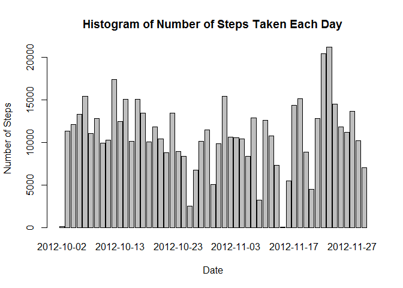
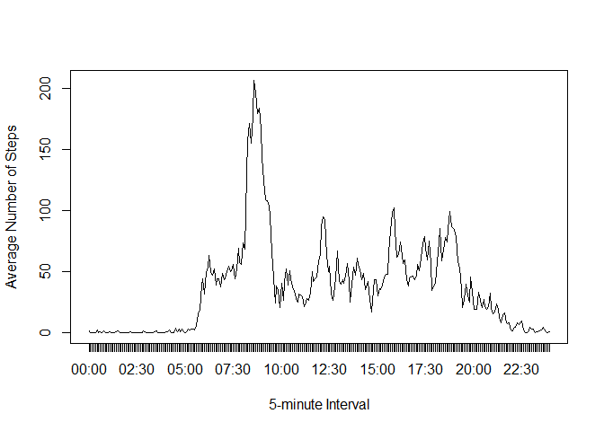
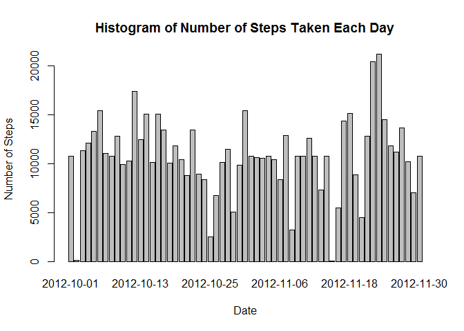
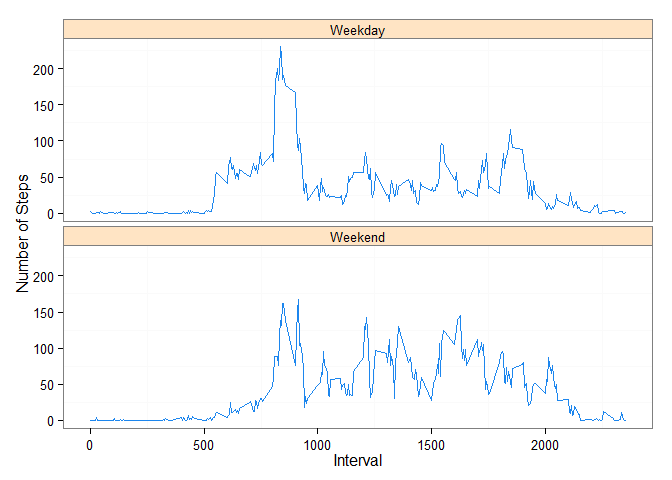

Reproducible Research: Project 1
========================================================
<br>

### Loading and preprocessing the data


```r
unzip("activity.zip")
data <- read.csv("activity.csv", header=T, na.strings = "NA")
data$date <- as.Date(data$date)
data$interval <- sprintf("%04d", data$interval)
data$interval <- paste(substring(data$interval, 1, 2), ":", substring(data$interval, 3, 4), sep="")
```
As a note, using the code above, the `date` column is converted to the type of Date, and the `interval` column is transformed to the format of "hh:mm", which is believed to be more meaningful.
<br><br>

### What is mean total number of steps taken per day?
Filter out missing values and create a neat dataset for this analysis.

```r
completeData <- data[!is.na(data$steps),]
```

Make a histogram of the total number of steps taken each day.

```r
stepsEachDay <- tapply(completeData$steps, completeData$date, sum)
barplot(stepsEachDay, main="Histogram of Number of Steps Taken Each Day", xlab="Date", ylab = "Number of Steps")
```

 

Calculate mean and median total number of steps taken per day.

Mean total number of steps per day:

```r
oldMean <- mean(stepsEachDay)
oldMean
```

```
## [1] 10766.19
```

Median total number of steps per day:

```r
oldMedian <- median(stepsEachDay)
oldMedian
```

```
## [1] 10765
```
<br>

### What is the average daily activity pattern?
Make a time series plot of the 5-minute interval and the average number of steps taken, averaged across all days.

```r
stepsByInterval <- tapply(completeData$steps, completeData$interval, mean)
plot(stepsByInterval, type="l", xlab="5-minute Interval", ylab="Average Number of Steps", xaxt="n")
axis(1, at=1:length(stepsByInterval), labels=names(stepsByInterval), las=0 )
```

 

Which 5-minute interval, on average across all the days in the dataset, contains the maximum number of steps?

```r
names(which.max(stepsByInterval))
```

```
## [1] "08:35"
```

This corresponds to interval <b>835</b> in the original dataset.
<br><br>

### Imputing missing values
Calculate and report the total number of missing values in the dataset (i.e. the total number of rows with NAs).

```r
nrow(data) - nrow(completeData)
```

```
## [1] 2304
```

Devise a strategy for filling in all of the missing values in the dataset. The strategy used here is using the means for 5-minute intervals across all days.

```r
stepsByIntervalDF <- data.frame(stepsByInterval=stepsByInterval, interval=names(stepsByInterval))
interimData <- merge(data, stepsByIntervalDF, by="interval", sort=FALSE)
missingSteps <- is.na(interimData$steps)
interimData[missingSteps, ]$steps <- interimData[missingSteps, ]$stepsByInterval
```

Create a new dataset that is equal to the original dataset but with the missing data filled in.

```r
newData <- interimData[, c(2,3,1)]
newData <- newData[order(newData$date, newData$interval),]
rownames(newData) <- 1 : nrow(newData)
```

Make a histogram of the total number of steps taken each day using the new dataset.

```r
newStepsEachDay <- tapply(newData$steps, newData$date, sum) 
barplot(newStepsEachDay, main="Histogram of Number of Steps Taken Each Day", xlab="Date", ylab = "Number of Steps")
```

 

Calculate and report the mean and median total number of steps taken per day, using the new dataset.

Mean total number of steps per day:

```r
newMean <- mean(newStepsEachDay)
newMean
```

```
## [1] 10766.19
```

Median total number of steps per day:

```r
newMedian <- median(newStepsEachDay)
newMedian
```

```
## [1] 10766.19
```

Compare them with the two before data imputation:

```r
newMean - oldMean
```

```
## [1] 0
```

```r
newMedian - oldMedian
```

```
## [1] 1.188679
```

**Q: Do these values differ from the estimates from the first part of the assignment?**

A: No change to the mean, and very slight increase to the median.

**Q: What is the impact of imputing missing data on the estimates of the total daily number of steps?**

A: As can be seen by comparing the two histograms above, there is no impact on the days with no data imputation needed but big impact on the other days that had data imputation.
<br><br>

### Are there differences in activity patterns between weekdays and weekends?
Create a new factor variable in the dataset with two levels - "weekday" and "weekend" indicating whether a given date is a weekday or weekend day.

```r
DayAllocator <- function(date) {
    if (weekdays(date) %in% c("Saturday", "Sunday")) return("Weekend")
    else return("Weekday")
}
newData$whatDay <- as.factor(sapply(newData$date, DayAllocator))
```

Make a panel plot containing a time series plot of the 5-minute interval and the average number of steps taken, averaged across all weekday days or weekend days.

```r
library(reshape2)
mNewData <- melt(newData, id.vars=c("date","interval","whatDay"))
stepsByDayAndInterval <- dcast(mNewData, whatDay + interval ~ variable, fun.aggregate = mean)

library(ggplot2)
stepsByDayAndInterval$int <- as.integer(substring(stepsByDayAndInterval$interval, 1, 2)) * 100 + as.integer(substring(stepsByDayAndInterval$interval, 4, 5))

ggplot(stepsByDayAndInterval, aes(x=int, y=steps)) +
  geom_line(col="dodgerblue2") +
  facet_wrap(~ whatDay, ncol=1) +
  xlab("Interval") +
  ylab("Number of Steps") +
  theme_bw() +
  theme(panel.grid.major = element_blank(), strip.background = element_rect(fill = "bisque"))
```

 

Yes, there are differences in activity patterns between weekdays and weekends. On average, people take more steps in the morning between around 8:00 and 9:30 in weekdays than in weekends.  However, people take more steps between around 9:30 and 21:00 (across most of the time intervals) in weekend than in weekdays, again on average.
