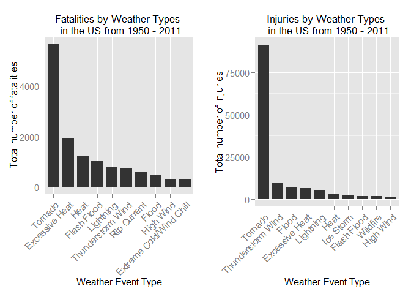
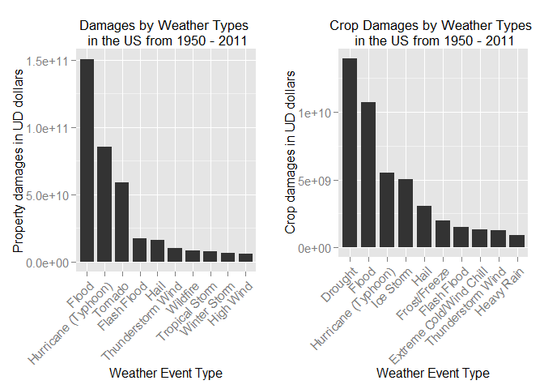

Reproducible Research: Assignment 2
========================================================
<br>

### Impact Analysis of Severe Weather Events on Public Health and Economy in the U.S.

<br>

*Bing Mei*

*Jan. 24, 2015*

<br>

### Synonpsis

In this study, the impact of different severe weather events on public health and economy is analyzed using the U.S. National Oceanic and Atmospheric Administration's (NOAA) storm database for years 1950 through 2011. Specifically, data on fatalities and injuries are used to identify the types of weather events that are most harmful to population health. Data on property and crop damages are explored to determine which types of events have the greatest economic consequences. The study found that tornado caused the most fatalities and injuries, while flood caused the most property damages (in US dollars), followed by hurricane/typhoon and tornado. The most crop damages were caused by drought and flood with hurricane/typhoon in the third place.

### Introduction

Storms and other severe weather events can cause both public health and economic problems for communities and municipalities. Many severe events can result in fatalities, injuries, and property damage, and preventing such outcomes to the extent possible is a key concern.

This project involves exploring the U.S. National Oceanic and Atmospheric Administration's (NOAA) storm database. This database tracks characteristics of major storms and weather events in the United States, including when and where they occur, as well as estimates of any fatalities, injuries, and property damage.

### Data Processing

This analysis is based on the [Storm Database](http://www.ncdc.noaa.gov/stormevents/ftp.jsp) from [National Climatic Data Center](http://www.ncdc.noaa.gov/). After reviewing the dataset and the [data documentation](https://d396qusza40orc.cloudfront.net/repdata%2Fpeer2_doc%2Fpd01016005curr.pdf), it is determined to use data in the `FATALITIES`, `INJURIES`, `PROPDMG`, `PROPDMGEXP`, `CROPDMG`, `CROPDMGEXP`, and `EVTYPE` columns for studying the impact of severe weather on public health and economy.

First, load data into R.

```r
if (!"stormData" %in% ls()) {
    stormData <- read.csv(bzfile("repdata-data-StormData.csv.bz2"))
}

dim(stormData)
```

```
## [1] 902297     37
```

There are 902297 records and 37 variables/attributes in the raw dataset.

According to the [Storm Data Documentation](https://d396qusza40orc.cloudfront.net/repdata%2Fpeer2_doc%2Fpd01016005curr.pdf), in the raw dataset the `PROPDMGEXP` and `CROPDMGEXP` columns store multipliers for corresponding values in the `PROPDMG` and `CROPDMG` columns for each observation. Letters along with a few numbers are observed in both multiplier columns. They need to be converted into numeric values before being able to be used to compute damage costs. The *converter* function below accomplishes this task and adds two new columns to the raw dataset, namely `PROPDMGVAL` and `CROPDMGVAL`, which store damage costs in dollars for property damages and crop damages, respectively.


```r
converter <- function (data = stormData, field, new_field) {
    col_idx <- which(colnames(data) == field)
    
    data[, col_idx] <- as.character(data[, col_idx])
    data[toupper(data[, col_idx]) == "B", col_idx] <- "9"
    data[toupper(data[, col_idx]) == "M", col_idx] <- "6"
    data[toupper(data[, col_idx]) == "K", col_idx] <- "3"
    data[toupper(data[, col_idx]) == "H", col_idx] <- "2"
    data[toupper(data[, col_idx]) %in% c("-","+","?",""), col_idx] <- "0"
    data[, col_idx] <- as.numeric(data[, col_idx])
    
    # add a new field to store real dollar values
    data <- cbind(data, data[, col_idx - 1] * 10 ^ data[, col_idx])
    colnames(data)[dim(data)[2]] <- new_field
    
    return(data)
}

if (dim(stormData)[2] == 37) {
    stormData <- converter(stormData, "PROPDMGEXP", "PROPDMGVAL")
    stormData <- converter(stormData, "CROPDMGEXP", "CROPDMGVAL")
}
```

Variable `EVTYPE` is another critical one, which stores severe weather types.


```r
length(unique(stormData$EVTYPE))
```

```
## [1] 985
```

There are 985 unique weather event types in the dataset.  However, according to the [Storm Data Documentation](https://d396qusza40orc.cloudfront.net/repdata%2Fpeer2_doc%2Fpd01016005curr.pdf), there should be only 48 offical types. Typos and many inconsistent entries are found in the `EVTYPE` column in the raw dataset. It is therefore cleaned and processed using regular expressions (Regex) and the process is embedded as a middle step in the *processor* function, which is described in more detail in next section.

### Data Analysis

Data analysis steps are built into the *processor* function, as shown below; the comments in the code provides detailed information. The *processor* function takes a few raw data items as input and outputs the summation of fatalities, injuries, or damages for each cleaned weather event type. The output data is ordered by the summation descendingly and therefore can be readily used to answer the questions this analysis aims at.


```r
processor <- function(data = stormData, subj.field, by.field, evregex) {
    subj_idx <- which(colnames(data) == subj.field)
    by_idx <- which(colnames(data) == by.field)
  
    # subset data - only keep those with non-zero number of events for the subject
    data2 <- data[data[, subj_idx] > 0, ]
    
    # aggregate data before regexing event types for computing efficiency
    aggregDF <- aggregate(data2[, subj_idx] ~ data2[, by_idx], data = data2, FUN = sum)
    
    # add a new field to store cleaned EVTYPE using regex, with initial value set to "Unassigned"
    aggregDF$CLEANEV <- "Unassigned"
    
    # regex now
    for (i in 1:nrow(evregex)) {
        selector <- grepl(evregex[, 2][i], aggregDF[, 1], ignore.case=T)
        
        if (any(selector)) {
            aggregDF[selector, ]$CLEANEV = evregex[, 1][i]
        }
    }  
    
    # aggreage the aggregated table again based on same CLEANEV values due to regexing
    aggregDF2 <- aggregate(aggregDF[, 2] ~ aggregDF[, 3], data = aggregDF, FUN = sum)
    
    # sort the final table by the number of subjects descendingly
    aggregDF2 <- aggregDF2[order(-aggregDF2[, 2]), ]

    # reset column and row names
    colnames(aggregDF2) <- c("CLEANEV", subj.field)
    rownames(aggregDF2) <- 1 : nrow(aggregDF2)
    
    # remove rows with CLEANEV = Unassigned
    aggregDF2 <- aggregDF2[aggregDF2$CLEANEV != "Unassigned", ]
    
    # return the sorted data frame
    return(aggregDF2)
}
```

As an argument to the *processor* function, evregex reads data from a correspondence table prepared beforehand, which stores in pair the 48 offical event types and their corresponding regular expressions used to match the `EVTYPE` data in the raw dataset. The table can be found in the same folder as this document.


```r
evregex <- read.csv("regex for storm data.csv", header=T, colClasses=c("character", "character"))
```

### Results

Results are readily available by just calling the *processor* function.

```r
fatalities <- processor(stormData, "FATALITIES", "EVTYPE", evregex)
injuries <- processor(stormData, "INJURIES", "EVTYPE", evregex)
propdamages <- processor(stormData, "PROPDMGVAL", "EVTYPE", evregex)
cropdamages <- processor(stormData, "CROPDMGVAL", "EVTYPE", evregex)
```

#### Impact on Public Health

The top 10 severe weather event types that caused the most personal fatalitles in the US are shown below along with the fatalitles.


```r
head(fatalities, n=10)
```

```
##                    CLEANEV FATALITIES
## 1                  Tornado       5658
## 2           Excessive Heat       1922
## 3                     Heat       1216
## 4              Flash Flood       1035
## 5                Lightning        817
## 6        Thunderstorm Wind        729
## 7              Rip Current        577
## 8                    Flood        489
## 9                High Wind        295
## 10 Extreme Cold/Wind Chill        287
```

The top 10 severe weather event types that caused the most personal injuries are:


```r
head(injuries, n=10)
```

```
##              CLEANEV INJURIES
## 1            Tornado    91364
## 2  Thunderstorm Wind     9532
## 3              Flood     6802
## 4     Excessive Heat     6525
## 5          Lightning     5231
## 6               Heat     2699
## 7          Ice Storm     2197
## 8        Flash Flood     1800
## 9           Wildfire     1606
## 10         High Wind     1507
```

The figure below shows the total fatalities and total injuries by those severe weather types side by side.


```r
library(ggplot2)
library(gridExtra)
```

```
## Loading required package: grid
```

```r
fatalityPlot <- ggplot(data = head(fatalities, n=10), 
                       aes(x = reorder(CLEANEV, order(FATALITIES, decreasing = TRUE)), y = FATALITIES)) +
                geom_bar(stat = "identity", width = 0.8) +
                labs(y = "Total number of fatalities", x = "Weather Event Type",
                     title = "Fatalities by Weather Types \n in the US from 1950 - 2011") +
                theme(legend.position="none", axis.text.x=element_text(angle=45, hjust=1, size=11), 
                      axis.text.y=element_text(size=11), plot.title=element_text(size=13))

injuryPlot <- ggplot(data = head(injuries, n=10), 
                     aes(x = reorder(CLEANEV, order(INJURIES, decreasing = TRUE)), y = INJURIES)) +
              geom_bar(stat = "identity", width = 0.8) +
              labs(y = "Total number of injuries", x = "Weather Event Type",
                   title = "Injuries by Weather Types \n in the US from 1950 - 2011") +
              theme(legend.position="none", axis.text.x=element_text(angle=45, hjust=1, size=11), 
                    axis.text.y=element_text(size=11), plot.title=element_text(size=13))

grid.arrange(fatalityPlot, injuryPlot, ncol = 2)
```

 

According to the lists and the histograms above, it is obvious that **Tornado** is the most dangerous weather type that caused the most fatalities, followed by **Excessive Heat**, and the most injuries, followed by **Thunderstorm Wind**, in the United State from 1950 to 2011.

#### Impact on Economy

The top 10 severe weather types that caused the most property damages in the US are shown below along with the damages in US dollars.


```r
head(propdamages, n=10)
```

```
##                CLEANEV   PROPDMGVAL
## 1                Flood 150583266737
## 2  Hurricane (Typhoon)  85356410010
## 3              Tornado  58552151927
## 5          Flash Flood  17588045096
## 6                 Hail  15977560513
## 7    Thunderstorm Wind   9977449150
## 8             Wildfire   8496563500
## 9       Tropical Storm   7714390550
## 10        Winter Storm   6750009751
## 11           High Wind   6004961043
```

Here are the top 10 severe weather types that caused the most crop damages in the US.


```r
head(cropdamages, n=10)
```

```
##                    CLEANEV  CROPDMGVAL
## 1                  Drought 13972581000
## 2                    Flood 10729708950
## 3      Hurricane (Typhoon)  5516117800
## 4                Ice Storm  5027114300
## 5                     Hail  3046887623
## 6             Frost/Freeze  1997061000
## 7              Flash Flood  1532197150
## 8  Extreme Cold/Wind Chill  1313023000
## 9        Thunderstorm Wind  1253958988
## 10              Heavy Rain   939160800
```

The figure below shows the total property damages and crop damages by those severe weather types side by side.


```r
propdmgPlot <- ggplot(data = head(propdamages, n=10), 
                      aes(x = reorder(CLEANEV, order(PROPDMGVAL, decreasing = TRUE)), y = PROPDMGVAL)) +
               geom_bar(stat = "identity", width = 0.8) +
               labs(y = "Property damages in UD dollars", x = "Weather Event Type",
                    title = "Damages by Weather Types \n in the US from 1950 - 2011") +
               theme(legend.position="none", axis.text.x=element_text(angle=45, hjust=1, size=11), 
                     axis.text.y=element_text(size=11), plot.title=element_text(size=13))

cropdmgPlot <- ggplot(data = head(cropdamages, n=10), 
                      aes(x = reorder(CLEANEV, order(CROPDMGVAL, decreasing = TRUE)), y = CROPDMGVAL)) +
               geom_bar(stat = "identity", width = 0.8) +
               labs(y = "Crop damages in UD dollars", x = "Weather Event Type",
                    title = "Crop Damages by Weather Types \n in the US from 1950 - 2011") +
               theme(legend.position="none", axis.text.x=element_text(angle=45, hjust=1, size=11), 
                     axis.text.y=element_text(size=11), plot.title=element_text(size=13))

grid.arrange(propdmgPlot, cropdmgPlot, ncol = 2)
```

 

According to the lists and the histograms above, it can be seen that **Flood**, **Hurrican (Typhoon)**, and **Tornado** are the top 3 weather types that caused the most property damages in the US from 1950 50 2011, while **Drought**, **Flood**, **Hurrican (Typhoon)**, and **Ice Storm** caused the most crop damages.
