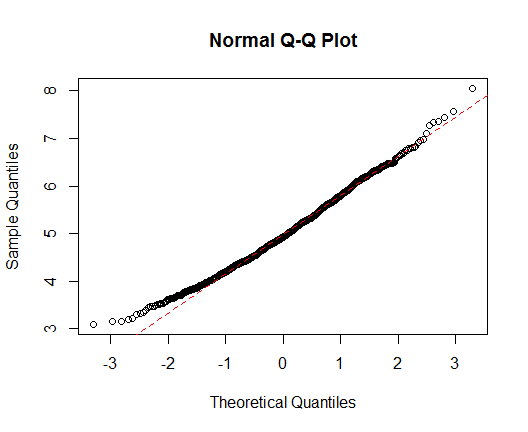

Statistical Inference: Project - Part 1
========================================================
## Simulation of Exponential Distribution using R

*Bing Mei*

*January 21, 2015*

<br>

### Project Requirements
In this part of the project you will investigate the exponential distribution in R and compare it with the Central Limit Theorem. The exponential distribution can be simulated in R with rexp(n, lambda) where lambda is the rate parameter. The mean of exponential distribution is 1/lambda and the standard deviation is also 1/lambda. Set lambda = 0.2 for all of the simulations. You will investigate the distribution of averages of 40 exponentials. Note that you will need to do a thousand simulations.

Illustrate via simulation and associated explanatory text the properties of the distribution of the mean of 40 exponentials.  You should:  
1. Show the sample mean and compare it to the theoretical mean of the distribution.  
2. Show how variable the sample is (via variance) and compare it to the theoretical variance of the distribution.  
3. Show that the distribution is approximately normal.

### Solution

#### Simulations

The simulation is conducted in R by drawing 40 expontials each time and drawing 1000 times. The exponentials are drawn from the exponential distribution with lambda = 0.2.

```r
set.seed(1)
lambda <- 0.2
samplesize <- 40
nsims <- 1000
samples <- matrix(rexp(samplesize * nsims, rate = lambda), nsims, samplesize)
means <- rowMeans(samples)
head(means)
```

```
## [1] 4.901268 5.229248 6.401541 4.744251 5.176057 5.170522
```

#### Result Analysis

##### 1. Show the sample mean and compare it to the theoretical mean of the distribution.

```r
mean.of.means <- mean(means)
mean.of.means
```

```
## [1] 4.990025
```

```r
theory.mean = 1 / lambda
theory.mean
```

```
## [1] 5
```

As shown above, the sample mean is 4.9900252, which is where the sample distirbution is centered at, and the theoretical mean of the distribution is 5.  The sample mean is very close to the theoretical mean.

##### 2. Show how variable the sample is (via variance) and compare it to the theoretical variance of the distribution.

```r
var.of.means <- var(means)
var.of.means
```

```
## [1] 0.6177072
```

```r
theory.var = 1 / lambda^2
theory.var
```

```
## [1] 25
```

The variance of the sample means is 0.6177072, while the theoretical variance of the exponential distribution is 25.  The former is about equal to the latter divided by the sample size of 40, which is 25 / 40 = 0.625. Again, the simulation result conforms to the theory well.

##### 3. Show that the distribution is approximately normal.

Below is a histogram plot of the means of the 1000 simulations conducted above. Also shown on the plot is the density curve computed using the sample means overlaid with a theoretical normal distribution curve with mean of 5 (=1/lambda) and standard deviation of 0.7906 (=1/lambda/sqrt(40)).

```r
hist(means, breaks=30, prob=TRUE,
     main = "Distribution of Sample Means \n(overlaid with Normal Distribution curve)",
     xlab = "", lty=1)
lines(density(means))
abline(v=1/lambda, col="red")
x <- seq(min(means), max(means), length=100)
y <- dnorm(x, mean=1/lambda, sd=1/lambda/sqrt(samplesize))
lines(x, y, col="red", lty=2)
legend('topright', c("simulated distribution", "normal distribution"),
       lty=c(1,2), col=c("black", "red"))
```

 

The bell-shaped histogram appears to agree with the theoretical normal distribution curve pretty well.  The q-q plot below also suggests overall good normality of the sample distribution (except in the tails).


```r
qqnorm(means)
qqline(means, col="red", lty=2)
```

 
