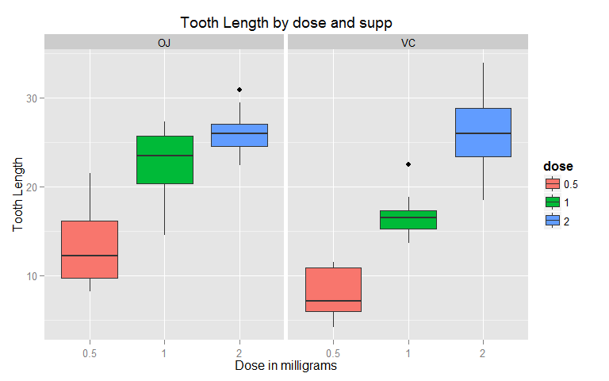

Statistical Inference: Project - Part 2
========================================================
## Basic Inferential Data Analysis

*Bing Mei*  
*January 22, 2015*

### Project Requirements
In the second portion of the class, we're going to analyze the ToothGrowth data in the R datasets package.  
* Load the ToothGrowth data and perform some basic exploratory data analyses.  
* Provide a basic summary of the data.  
* Use confidence intervals and/or hypothesis tests to compare tooth growth by supp and dose. (Only use the techniques from class, even if there's other approaches worth considering)  
* State your conclusions and the assumptions needed for your conclusions.  

### Solution
*1. Load the ToothGrowth data and process the data where necessary*


```r
library(datasets)
data(ToothGrowth)
str(ToothGrowth)
```

```
## 'data.frame':	60 obs. of  3 variables:
##  $ len : num  4.2 11.5 7.3 5.8 6.4 10 11.2 11.2 5.2 7 ...
##  $ supp: Factor w/ 2 levels "OJ","VC": 2 2 2 2 2 2 2 2 2 2 ...
##  $ dose: num  0.5 0.5 0.5 0.5 0.5 0.5 0.5 0.5 0.5 0.5 ...
```
Check the number of unique values of variable dose:

```r
table(ToothGrowth$dose)
```

```
## 
## 0.5   1   2 
##  20  20  20
```
Convert dose from numeric to factor:

```r
ToothGrowth$dose <- as.factor(ToothGrowth$dose)
```

*2. Provide a basic summary of the data*

A statistical summary is provided below for all the three variables in the dataset. As shown, the mean of tooth length (i.e. len) is 18.8 and the median is 19.25. There are 3 levels of dosages, 0.5, 1, and 2. Delivery methods (supp) include OJ and VC.

```r
summary(ToothGrowth)
```

```
##       len        supp     dose   
##  Min.   : 4.20   OJ:30   0.5:20  
##  1st Qu.:13.07   VC:30   1  :20  
##  Median :19.25           2  :20  
##  Mean   :18.81                   
##  3rd Qu.:25.27                   
##  Max.   :33.90
```

Distribution of data records across dosage (dose) and delivery method (supp) is as follows:


```r
table(ToothGrowth$supp, ToothGrowth$dose)
```

```
##     
##      0.5  1  2
##   OJ  10 10 10
##   VC  10 10 10
```

*3. Perform some basic exploratory data analyses*

The data is first explored by ploting tooth lengths against dosages and supplement types. As shown in the figure below, it is noticed that within either the OJ group or the VC group, tooth lengths seem to positively correlate with dosages. By comparing average tooth lengths for the same dosage level (i.e. boxes with the same color), it appears that different supplement types produce substantially different tooth lengths, except for the 2-milligram dose level.  Formal statistical tests will be conducted later.

```r
library(ggplot2)
plot <- ggplot(ToothGrowth, aes(x = dose, y = len, fill = dose)) +
        geom_boxplot() + facet_grid(. ~ supp) +
        xlab("Dose in milligrams") + ylab("Tooth Length") +
        ggtitle("Tooth Length by dose and supp") + 
        theme(plot.title = element_text(size=14, vjust=1),
              legend.title = element_text(size=12, face="bold"))
print(plot)
```

 

*4. Use confidence intervals and/or hypothesis tests to compare tooth growth by supp and dose*

Assuming that the data is randomly sampled from a population that follows normal distribution, t tests are used to compare tooth growth by supp and dose in this study.

1\) Tooth length by dose:

There are three dosage levels.  Comparisons are therefore made for every two of them and there are three t tests in total.  The null hypothesis is that the means are equal, indicating that dosage has no impact on tooth length.

```r
dose.t1 <- t.test(ToothGrowth$len[ToothGrowth$dose==0.5], ToothGrowth$len[ToothGrowth$dose==1], paired=F, var.equal=F)
dose.t2 <- t.test(ToothGrowth$len[ToothGrowth$dose==0.5], ToothGrowth$len[ToothGrowth$dose==2], paired=F, var.equal=F)
dose.t3 <- t.test(ToothGrowth$len[ToothGrowth$dose==1], ToothGrowth$len[ToothGrowth$dose==2], paired=F, var.equal=F)
dose.result <- data.frame("p-value"=c(dose.t1$p.value, dose.t2$p.value, dose.t3$p.value),
                          "Lower.CI"=c(dose.t1$conf[1], dose.t2$conf[1], dose.t3$conf[1]),
                          "Upper.CI"=c(dose.t1$conf[2], dose.t2$conf[2], dose.t3$conf[2]),
                          row.names=c("Dose 0.5 vs 1:", "Dose 0.5 vs 2:", "Dose 1 vs 2:"))
dose.result
```

```
##                     p.value   Lower.CI   Upper.CI
## Dose 0.5 vs 1: 1.268301e-07 -11.983781  -6.276219
## Dose 0.5 vs 2: 4.397525e-14 -18.156167 -12.833833
## Dose 1 vs 2:   1.906430e-05  -8.996481  -3.733519
```
It shows that all the p-values are way below 0.05 and none of the confidence intervals include 0. This suggests that all the null hypotheses should be rejected. The negative sign of the intervals indicate that the lower the dose level, the shorter the teeth on average.

2\)  Tooth length by supp:

T test is then conducted to examine the means of tooth lengths by supplement type (supp).

```r
supp.t <- t.test(len ~ supp, paired=F, var.equal=F, data=ToothGrowth)
supp.t$p.value
```

```
## [1] 0.06063451
```

The p-value above indicates that at the 5% significance level, the null hypothesis that different supplement types produce equal tooth lengths cannot be rejected.

3\)  Tooth length by supp for each dose level:

Further tests are conducted to compare tooth length means by supplement type (OJ vs. VC) for each dose level.

```r
supp.t1 <- with(ToothGrowth, t.test(len[dose==0.5 & supp=="OJ"], len[dose==0.5 & supp=="VC"], paired=F, var.equal=F))
supp.t2 <- with(ToothGrowth, t.test(len[dose==1 & supp=="OJ"], len[dose==1 & supp=="VC"], paired=F, var.equal=F))
supp.t3 <- with(ToothGrowth, t.test(len[dose==2 & supp=="OJ"], len[dose==2 & supp=="VC"], paired=F, var.equal=F))
supp.result <- data.frame("p-value"=c(supp.t1$p.value, supp.t2$p.value, supp.t3$p.value),
                          "Lower.CI"=c(supp.t1$conf[1], supp.t2$conf[1], supp.t3$conf[1]),
                          "Upper.CI"=c(supp.t1$conf[2], supp.t2$conf[2], supp.t3$conf[2]),
                          row.names=c("Dose 0.5:", "Dose 1:", "Dose 2:"))
supp.result
```

```
##               p.value  Lower.CI Upper.CI
## Dose 0.5: 0.006358607  1.719057 8.780943
## Dose 1:   0.001038376  2.802148 9.057852
## Dose 2:   0.963851589 -3.798070 3.638070
```

The results indicate that different supplement types do produce significant differences in tooth length at the 5% significance level for dose levels of 0.5 and 1, but they do NOT for dose 2.  The positive sign of the confidence intervals for doses 0.5 and 1 indicates that OJ produces longer teeth than VC on average.

### Conclusions
Based on the exploratory analysis and t tests conducted above, we can conclude that:  
1.  Both dosage (dose) and supplement type (supp) have significant impact on tooth growth.  
2.	The three levels of dose produce average tooth lengths significantly different from one another at the 5% significance level.  On average, the higher the dose level, the longer the teeth.  
3.	Supplement type (supp) is significant in producing different tooth lengths at the 10% significance level but not at 5%.  When broken down by dose levels, it is significant at the 5% significance level for dose levels of 0.5 and 1, while not at all for dose 2.  For dose levels of 0.5 and 1, the OJ supplement type produces longer teeth on average than the VC type.

Finally, using t test for this analysis assumes that the data is random samples from normal distribution.
